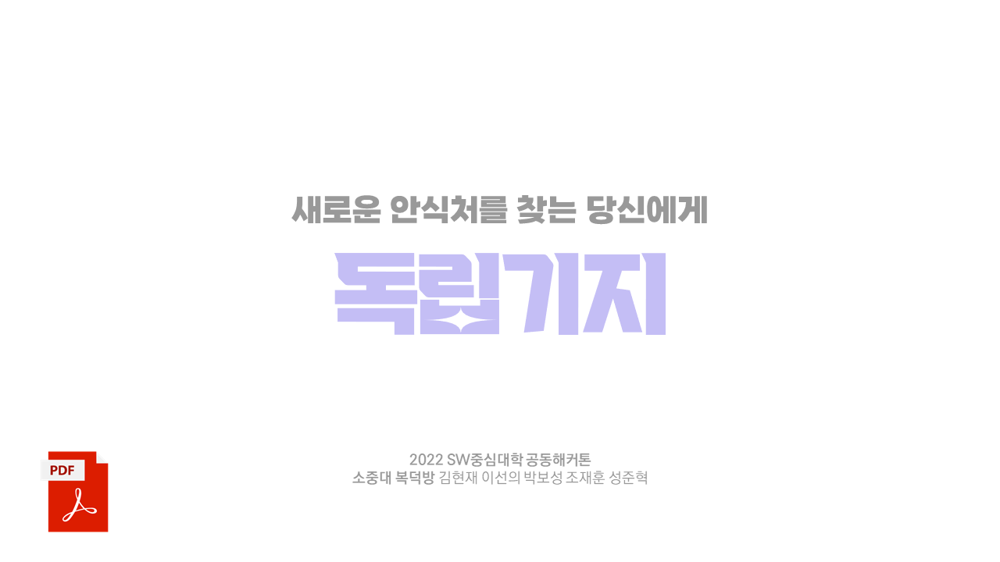
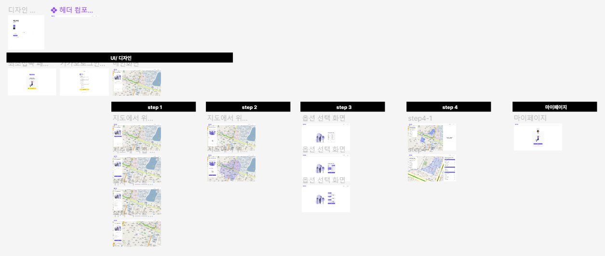

 
사용자 중심의 부동산 탐색 플랫폼 
<strong>독립기지</strong>

## 📖 프로젝트 소개

> 아무리 집 구하는 건 발품을 파는거라지만 이건 너무 심한거 아냐?

**독립기지**는 사용자의 생활패턴을 중심으로 부동산을 탐색할 수 있는 웹 서비스입니다. **사용자의 생활 거점(회사, 학교 등)** 을 중심으로, 단순 직선거리가 아닌 보행시간을 고려하여 후보지를 함께 찾아줍니다.

<table>
	<tr>
		<td width=50%>
			
		</td>
		<td width=50%>
			
		</td>
	</tr>
	<tr>
		<td align="center">
			<b>소개 영상</b>
		</td>
		<td align="center">
			<b>발표 자료</b>
		</td>
	</tr>
</table>

## 🎨 디자인 시안 (Sample Design)

> 이미지를 클릭할 시 Figma로 이동합니다.

?node-id=0%3A1)

## 🔧 기술 스택 (Technique Used)
### Server(back-end)
 - Spring Boot
 
### front-end
 -  React.js
 -  MUI(MATERIAL DESIGN)

## ⚙ 주요 사용 API (Major External Services)
 - Kakao 지도 API [🔗](https://apis.map.kakao.com/)
 - Kakao oauth API [🔗](https://developers.kakao.com/docs/latest/ko/kakaologin/rest-api)
 - Mapbox Isochrone API (보행시간) [🔗](https://docs.mapbox.com/playground/isochrone/)

## 👨‍💻 팀 정보 (Team Information)

<table>
<tbody align="center">
  <tr>
    <td width="20%"></td>
    <td width="20%"></td>
    <td width="20%"></td>
    <td width="20%"></td>
    <td width="20%"></td>
  </tr>
  <tr>
    <td>팀장</td>
    <td>백엔드</td>
    <td>백엔드</td>
    <td>프론트</td>
    <td>디자인</td>
  </tr>
  <tr>
    <td><a href="https://github.com/hughesgoon">김현재 (건국대)</a></td>
    <td><a href="https://github.com/sunnyineverywhere">이선의 (이화여대)</a></td>
    <td><a href="https://github.com/bosungpark">박보성 (한국외대)</a></td>
    <td><a href="https://github.com/jae-hun-e">조재훈 (한양대ERICA)</a></td>
    <td>성준혁 (순천향대)</td>
  </tr>
</tbody>
</table>